# Diagnostic Reasoning Diagrams for Medical Image Analysis

This document contains diagnostic flowcharts following the Chain-of-Thought pattern:
**Visual Observation → Image Analysis → Clinical Reasoning → Diagnosis**

Each diagram shows how imaging findings map to differential diagnoses, reflecting real-world clinical reasoning used to train the MedCoT model.

---

## 1. Chest X-Ray: Opacity in Lung Field

```mermaid
flowchart TD
    A["Finding: Opacity in Lung Field"] --> B{"Opacity Pattern?"}
    
    B -->|"Homogeneous, lobar"| C["Consolidation"]
    B -->|"Hazy, diffuse"| D["Ground-Glass Opacity"]
    B -->|"Round, well-defined"| E["Nodule / Mass"]
    B -->|"Linear, band-like"| F["Atelectasis"]
    
    C --> C1{"Air bronchograms?"}
    C1 -->|"Yes"| C2["Pneumonia"]
    C1 -->|"No"| C3["Pulmonary hemorrhage / Aspiration"]
    
    C2 --> C2a["Lobar → Bacterial (Strep. pneumoniae)"]
    C2 --> C2b["Multilobar → Atypical / Viral"]
    
    D --> D1{"Distribution?"}
    D1 -->|"Bilateral, perihilar"| D2["Pulmonary Edema"]
    D1 -->|"Peripheral, patchy"| D3["Viral Pneumonia / COVID-19"]
    D1 -->|"Diffuse"| D4["ARDS / DAD"]
    
    E --> E1{"Size?"}
    E1 -->|"< 3cm"| E2["Pulmonary Nodule"]
    E1 -->|"≥ 3cm"| E3["Lung Mass"]
    E2 --> E2a{"Margins?"}
    E2a -->|"Smooth, calcified"| E2b["Likely benign (granuloma)"]
    E2a -->|"Spiculated"| E2c["Suspicious for malignancy"]
    
    F --> F1["Causes: Mucus plug, tumor, post-operative"]
```



---

## 2. Chest X-Ray: Pleural Abnormalities

```mermaid
flowchart TD
    A["Finding: Pleural Abnormality"] --> B{"Type?"}
    
    B -->|"Costophrenic blunting"| C["Pleural Effusion"]
    B -->|"Visible pleural line"| D["Pneumothorax"]
    B -->|"Pleural thickening"| E["Chronic Process"]
    
    C --> C1{"Appearance?"}
    C1 -->|"Meniscus sign, layering"| C2["Free-flowing effusion"]
    C1 -->|"Loculated, non-dependent"| C3["Complex / Empyema"]
    
    C2 --> C2a{"Amount?"}
    C2a -->|"Blunting only"| C2b["Small (~200mL)"]
    C2a -->|"Opacification to mid-zone"| C2c["Moderate"]
    C2a -->|"Near-complete opacification"| C2d["Massive"]
    
    D --> D1{"Mediastinal shift?"}
    D1 -->|"Away from pneumothorax"| D2["🔴 Tension pneumothorax"]
    D1 -->|"No shift"| D3["Simple pneumothorax"]
    
    E --> E1["DDx: TB, asbestosis, prior empyema"]
```



---

## 3. Chest X-Ray: Cardiac Silhouette

```mermaid
flowchart TD
    A["Finding: Abnormal Cardiac Silhouette"] --> B{"Cardiothoracic Ratio?"}
    
    B -->|"> 0.5 on PA"| C["Cardiomegaly"]
    B -->|"Water-bottle shape"| D["Pericardial Effusion"]
    B -->|"Boot-shaped"| E["Right Ventricular Hypertrophy"]
    
    C --> C1{"Chamber enlargement?"}
    C1 -->|"Left atrial"| C2["Mitral valve disease"]
    C1 -->|"Left ventricular"| C3["Heart failure / HTN"]
    C1 -->|"Biventricular"| C4["Dilated cardiomyopathy"]
    
    D --> D1{"Rapid onset?"}
    D1 -->|"Yes"| D2["🔴 Cardiac tamponade risk"]
    D1 -->|"Gradual"| D3["Chronic (uremia, hypothyroid)"]
```



---

## 4. Brain MRI: Enhancing Lesion


---

## 5. Brain MRI: Non-Enhancing Abnormalities


---

## 6. Fundus Photography: Retinal Findings


---

## 7. Dermoscopy: Pigmented Lesion

```mermaid
flowchart TD
    A["Finding: Pigmented Skin Lesion"] --> B{"ABCDE Assessment"}
    
    B -->|"Symmetric, regular"| C["Likely Benign"]
    B -->|"Asymmetric, irregular"| D["Suspicious"]
    
    C --> C1{"Dermoscopic features?"}
    C1 -->|"Regular pigment network"| C2["Benign melanocytic nevus"]
    C1 -->|"Comedo-like openings"| C3["Seborrheic keratosis"]
    C1 -->|"Uniform blue"| C4["Blue nevus"]
    
    D --> D1{"7-Point Checklist"}
    D1 -->|"Blue-white veil"| D2["Major criterion (+2)"]
    D1 -->|"Atypical network"| D3["Major criterion (+2)"]
    D1 -->|"Irregular streaks"| D4["Major criterion (+2)"]
    D1 -->|"Score ≥ 3"| D5["🔴 Melanoma suspected → Biopsy"]
    
    D --> D6{"Other suspicious features?"}
    D6 -->|"Arborizing vessels"| D7["Basal cell carcinoma"]
    D6 -->|"Structureless zones"| D8["Amelanotic melanoma"]
```



---

## 8. CT Abdomen: Liver Lesion

```mermaid
flowchart TD
    A["Finding: Liver Lesion on CT"] --> B{"Enhancement pattern?"}
    
    B -->|"Peripheral nodular\n+ centripetal fill-in"| C["Hemangioma"]
    B -->|"Arterial enhancement\n+ portal washout"| D["🔴 HCC (Hepatocellular Ca)"]
    B -->|"Arterial enhancement\n+ no washout"| E["FNH / Adenoma"]
    B -->|"Hypodense, no enhancement"| F["Simple cyst"]
    B -->|"Ring enhancement"| G["Abscess / Metastasis"]
    
    D --> D1{"Cirrhotic liver?"}
    D1 -->|"Yes + AFP elevated"| D2["HCC confirmed (LI-RADS 5)"]
    D1 -->|"No"| D3["Consider other primary / metastasis"]
```



---

## 9. Pathology: Tissue Analysis

```mermaid
flowchart TD
    A["Finding: Histological Abnormality"] --> B{"Cell morphology?"}
    
    B -->|"Normal architecture\n+ inflammatory cells"| C["Inflammation"]
    B -->|"Disordered architecture\n+ atypical cells"| D["Dysplasia"]
    B -->|"Invasion through\nbasement membrane"| E["🔴 Invasive Carcinoma"]
    B -->|"Nuclear pleomorphism\n+ high mitoses"| F["High-Grade Malignancy"]
    
    C --> C1{"Infiltrate type?"}
    C1 -->|"Neutrophils"| C2["Acute inflammation"]
    C1 -->|"Lymphocytes"| C3["Chronic inflammation"]
    C1 -->|"Granulomas"| C4["Granulomatous (TB, sarcoid)"]
    
    E --> E1{"Differentiation?"}
    E1 -->|"Well-differentiated"| E2["Grade 1 (low grade)"]
    E1 -->|"Poorly differentiated"| E3["Grade 3 (high grade)"]
    E1 -->|"Undifferentiated"| E4["Grade 4 (anaplastic)"]
```



---

## 10. MRI Musculoskeletal: Joint Pathology

```mermaid
flowchart TD
    A["Finding: Joint Abnormality on MRI"] --> B{"Primary finding?"}
    
    B -->|"Ligament signal change"| C["Ligament Injury"]
    B -->|"Meniscal abnormality"| D["Meniscal Tear"]
    B -->|"Bone marrow edema"| E["Bone Bruise / Stress"]
    B -->|"Joint effusion"| F["Synovitis / Trauma"]
    
    C --> C1{"Signal?"}
    C1 -->|"Complete disruption"| C2["Complete tear (Grade III)"]
    C1 -->|"Thickened, high signal"| C3["Partial tear (Grade II)"]
    
    D --> D1{"Type?"}
    D1 -->|"Vertical through body"| D2["Longitudinal tear"]
    D1 -->|"Horizontal cleavage"| D3["Degenerative tear"]
    D1 -->|"Bucket handle"| D4["Displaced → Surgery likely"]
```



---

## Diagnostic Reasoning Pattern Summary


### CoT Reasoning Template

```
**Observation**: [What I see in the image]
    ↓
**Visual Analysis**: [Characterize the finding using medical terminology]
    ↓
**Clinical Reasoning**: [Connect findings to differential diagnosis]
    ↓
**Answer**: [Final diagnosis / answer to the question]
```

### Modality-Specific Reasoning Focus

| Modality | Primary Observation Focus | Key Reasoning Elements |
|----------|--------------------------|------------------------|
| Chest X-Ray | Opacity, silhouette, air | Distribution, pattern, associated findings |
| Brain MRI | Signal, enhancement, location | Intra vs extra-axial, territory, age |
| Fundus | Color, shape, location of lesions | Vascular patterns, disc changes |
| Dermoscopy | Structure, color, symmetry | Pattern analysis, scoring systems |
| CT Abdomen | Enhancement phases, density | Wash-in/washout, organ specificity |
| Pathology | Cell morphology, architecture | Grade, invasion, differentiation |
