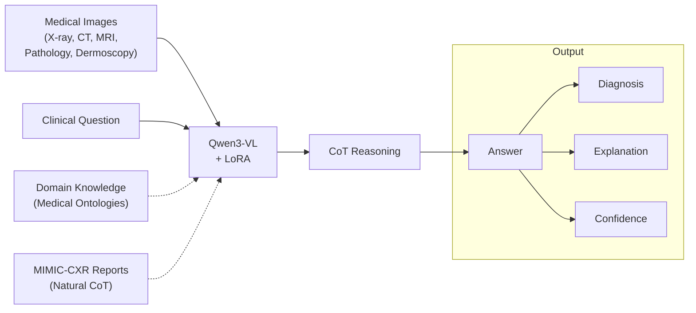
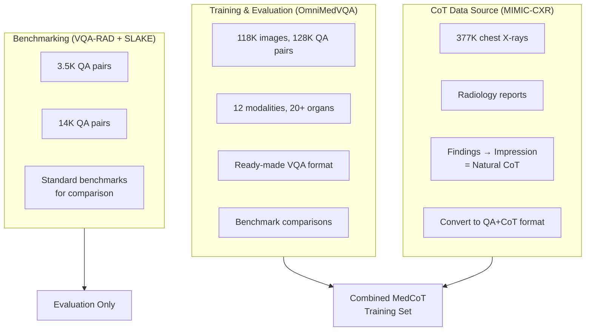
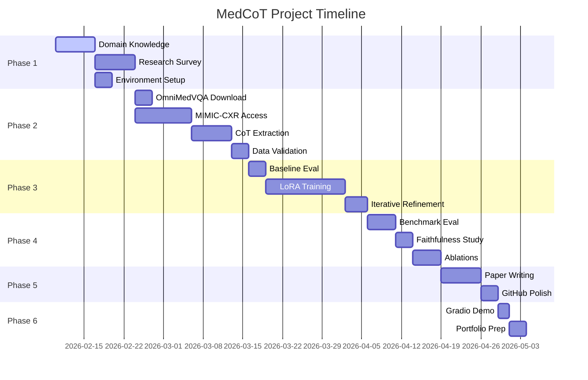

# MedCoT: Chain-of-Thought Medical Visual Question Answering

## Project Implementation Plan

> **Goal**: Build a Visual Chain-of-Thought system for explainable medical image diagnosis using Qwen3-VL with LoRA fine-tuning, targeting publication at MICCAI/ML4H workshops and filling multimodal LLM gap on CV.

---

## Project Overview



### Key Differentiators for Publication

| Novelty Element | Description | Target Venue |
|-----------------|-------------|--------------|
| **CoT-MedVQA Dataset** | First CoT-annotated medical VQA dataset from radiology reports | MICCAI Workshops |
| **Multi-Modality CoT** | Reasoning across 12 imaging modalities | ML4H / NeurIPS |
| **Faithfulness Analysis** | CoT vs Attention Map correlation in medical domain | BioNLP / ACL |
| **Domain-Specific SFT** | LoRA fine-tuning on medical terminology | Applied AI venues |

---

## Dataset Strategy

### Why Both: OmniMedVQA + MIMIC-CXR



| Dataset | Role | Size | Access | CoT? |
|---------|------|------|--------|------|
| **OmniMedVQA** | Training + Eval | 118K img, 128K QA | ✅ HuggingFace (open) | ❌ → generate |
| **MIMIC-CXR** | CoT source | 377K X-rays + reports | ✅ PhysioNet (credentialed) | ✅ Natural! |
| **VQA-RAD** | Benchmark | 315 img, 3.5K QA | ✅ Open | ❌ |
| **SLAKE** | Benchmark | 642 img, 14K QA | ✅ Open | ❌ |
| **PathVQA** | Benchmark | 5K img, 32K QA | ✅ Open | ❌ |
| **PMC-VQA** | Supplementary | 227K QA | ✅ Open | ❌ |

> **Strategy**: OmniMedVQA daje skalę i diversity modalności. MIMIC-CXR daje naturalne CoT z raportów radiologów. VQA-RAD/SLAKE służą jako standardowe benchmarki do porównania z SOTA.

---

## Phase 1: Foundation (Weeks 1-2)

### 1.1 Domain Knowledge Base

| Artifact | Status | Description |
|----------|--------|-------------|
| `Medical Findings Taxonomy.md` | TODO | Hierarchical medical findings classification |
| `Medical Glossary.md` | TODO | Medical imaging terminology for CoT |
| `Diagnostic Reasoning Diagrams.md` | TODO | Diagnostic flowcharts for CoT training |
| `SFT_DATA_FORMAT.md` | TODO | Medical VQA CoT conversation format |

### 1.2 Research Deep Dive

```
Week 1 Tasks:
├── [ ] Read OmniMedVQA paper (arXiv:2402.09181)
├── [ ] Study Qwen3-VL architecture paper
├── [ ] Survey: "Medical Visual Question Answering with LLMs"
│   └── Key papers: LLaVA-Med, R-LLaVA, Med-Flamingo, PMC-VQA
├── [ ] Survey: "Chain-of-Thought in Vision-Language Models"
│   └── Key papers: MM-CoT, Visual CoT, Multimodal-CoT
└── [ ] Identify research gap for novelty claim
```

### 1.3 Environment Setup

```bash
# Recommended Stack
conda create -n medcot python=3.10
conda activate medcot

# Core dependencies
pip install torch==2.1.0 torchvision
pip install transformers>=4.37.0
pip install peft>=0.7.0  # LoRA
pip install bitsandbytes  # Quantization
pip install accelerate
pip install wandb  # Experiment tracking
pip install gradio  # Demo interface

# Medical-specific
pip install pydicom  # DICOM handling (MIMIC-CXR)
pip install datasets  # HuggingFace datasets (OmniMedVQA)

# Model download
huggingface-cli download Qwen/Qwen3-VL-2B-Instruct
```

**Hardware Requirements**:
| Configuration | GPU Memory | Training Speed |
|---------------|------------|----------------|
| Minimum | 16GB (RTX 4080) | ~2 hrs/epoch |
| Recommended | 24GB (RTX 4090) | ~1 hr/epoch |
| Cloud Option | A100 40GB | < 30 min/epoch |

---

## Phase 2: Data Engineering (Weeks 3-4)

### 2.1 Data Collection Pipeline

```
data/
├── raw/
│   ├── omnimedvqa/          # HuggingFace download
│   ├── mimic_cxr_jpg/       # PhysioNet download (~600GB)
│   ├── vqa_rad/             # Benchmark
│   └── slake/               # Benchmark
├── processed/
│   ├── train.jsonl          # 80% combined training data
│   ├── val.jsonl            # 10% validation
│   └── test.jsonl           # 10% held-out test
└── cot_annotations/
    └── mimic_cot.json       # CoT extracted from reports
```

### 2.2 CoT Extraction from MIMIC-CXR Reports

```python
# scripts/extract_cot_from_reports.py

def extract_cot(report_text: str) -> dict:
    """
    Convert radiology report to CoT format.
    
    Input report structure:
        FINDINGS: [detailed observations]
        IMPRESSION: [diagnostic conclusion]
    
    Output CoT:
        Observation → Visual Analysis → Diagnosis → Answer
    """
    findings = parse_section(report_text, "FINDINGS")
    impression = parse_section(report_text, "IMPRESSION")
    
    return {
        "observation": findings,
        "visual_analysis": extract_key_findings(findings),
        "diagnosis": impression,
        "answer": summarize_diagnosis(impression)
    }
```

### 2.3 CoT Generation for OmniMedVQA (non-CXR modalities)

```python
# scripts/generate_cot.py

SYSTEM_PROMPT = """
You are an expert medical imaging specialist.
Analyze medical images following this exact format:

**Observation**: Describe what you see (anatomical structures, abnormalities, characteristics).
**Visual Analysis**: Characterize findings based on imaging features (density, contrast, morphology).
**Clinical Reasoning**: Connect visual findings to potential diagnoses.
**Answer**: Provide the final answer to the clinical question.
"""
```

**Target Dataset Size**:
| Split | Images | QA Pairs | CoT Annotations | Primary Source |
|-------|--------|----------|-----------------|----------------|
| Train | 10K+ | 15K+ | 15K+ | OmniMedVQA + MIMIC-CXR |
| Validation | 1K | 2K | 2K | OmniMedVQA + MIMIC-CXR |
| Test | 1K | 2K | 2K (human-verified) | OmniMedVQA + MIMIC-CXR |

### 2.4 Data Quality Checklist

- [ ] Balance modalities (min 500 samples per modality)
- [ ] Verify CoT logical consistency (sampling 10%)
- [ ] Check terminology alignment with Medical Glossary
- [ ] Ensure question type distribution is balanced
- [ ] Validate against clinical accuracy (subset review)

---

## Phase 3: Model Development (Weeks 5-7)

### 3.1 Baseline Evaluation

**Zero-Shot Testing Protocol**:
```python
# Evaluate Qwen3-VL out-of-the-box
models_to_test = [
    "Qwen/Qwen3-VL-2B-Instruct",
    "Qwen/Qwen3-VL-8B-Instruct",  # If resources allow
]

metrics = [
    "vqa_accuracy",           # Overall VQA accuracy
    "open_ended_accuracy",    # Free-form answer accuracy
    "closed_ended_accuracy",  # Yes/No accuracy
    "cot_completeness_score", # Does it produce all CoT sections?
    "hallucination_rate"      # Medical inaccuracies
]
```

**Expected Baseline Results** (to beat with fine-tuning):
| Metric | Expected Zero-Shot | Target Post-SFT |
|--------|-------------------|-----------------|
| VQA-RAD Accuracy | 50-65% | 80%+ |
| SLAKE Accuracy | 55-70% | 85%+ |
| CoT Completeness | 30% | 95%+ |
| Hallucination Rate | 30% | <10% |

### 3.2 Fine-Tuning Configuration

**LoRA Setup**:
```python
from peft import LoraConfig, get_peft_model

lora_config = LoraConfig(
    r=64,                    # Rank
    lora_alpha=128,          # Scaling
    target_modules=[
        "q_proj", "k_proj", "v_proj",  # Attention
        "o_proj", "gate_proj",          # FFN
        "up_proj", "down_proj"
    ],
    lora_dropout=0.1,
    bias="none",
    task_type="CAUSAL_LM"
)

# QLoRA for memory efficiency
bnb_config = BitsAndBytesConfig(
    load_in_4bit=True,
    bnb_4bit_quant_type="nf4",
    bnb_4bit_compute_dtype=torch.bfloat16,
)
```

**Training Hyperparameters**:
```yaml
training:
  epochs: 3
  batch_size: 4
  gradient_accumulation_steps: 4
  learning_rate: 2e-4
  warmup_ratio: 0.1
  lr_scheduler: cosine
  max_seq_length: 2048
  
optimization:
  optimizer: adamw_8bit
  weight_decay: 0.01
  gradient_checkpointing: true
  
monitoring:
  logging_steps: 10
  save_steps: 100
  eval_steps: 50
  wandb_project: "medcot"
```

### 3.3 Project Structure

```
src/
├── data/
│   ├── dataset.py          # Custom Dataset class (multi-dataset)
│   ├── cot_extractor.py    # MIMIC-CXR report → CoT
│   └── preprocessing.py    # Image transforms per modality
├── model/
│   ├── qwen_lora.py        # LoRA wrapper for Qwen3-VL
│   └── inference.py        # Inference pipeline
├── training/
│   ├── trainer.py          # Training loop
│   └── callbacks.py        # WandB, checkpointing
└── evaluation/
    ├── metrics.py          # VQA accuracy, BLEU, ROUGE
    ├── faithfulness.py     # Attention-CoT correlation
    └── benchmarks.py       # VQA-RAD, SLAKE, PathVQA eval
```

---

## Phase 4: Evaluation & Analysis (Weeks 8-9)

### 4.1 Quantitative Metrics

```python
evaluation_suite = {
    # VQA Accuracy
    "open_ended_accuracy": OpenEndedAccuracy(),
    "closed_ended_accuracy": ClosedEndedAccuracy(),
    "overall_accuracy": OverallAccuracy(),
    
    # Reasoning Quality
    "cot_bleu": BLEUScore(),
    "cot_rouge": ROUGEScore(),
    "clinical_accuracy": ClinicalAccuracyScore(),
    
    # Faithfulness
    "attention_cot_correlation": AttentionCoTCorrelation(),
    "hallucination_rate": MedicalHallucinationDetector(),
}
```

### 4.2 Benchmark Comparison

| Model | VQA-RAD | SLAKE | PathVQA | Source |
|-------|---------|-------|---------|--------|
| LLaVA-Med | ~60% | ~70% | ~55% | Paper |
| R-LLaVA | ~81% | ~90% | ~60% | 2024 |
| **MedCoT (ours)** | **TBD** | **TBD** | **TBD** | This work |

### 4.3 Ablation Studies

```
Ablation Matrix:
├── Base Model Size: 2B vs 8B
├── Training Data Size: 2K / 5K / 10K samples
├── CoT Format: Structured vs Free-form
├── Data Source: OmniMedVQA only vs +MIMIC-CXR CoT
├── LoRA Rank: 16 / 32 / 64
└── Modality: Single (CXR only) vs Multi-modality
```

### 4.4 Faithfulness Analysis (Publication Key!)

```python
def analyze_faithfulness(model, image, question, generated_cot):
    """
    Compare what model 'sees' (attention) vs 'says' (CoT).
    
    In medical context: Does the model look at the correct
    anatomical region when it mentions it in the CoT?
    """
    attention_maps = extract_attention_maps(model, image, question)
    mentioned_regions = parse_cot_for_anatomical_refs(generated_cot)
    
    iou = compute_iou(attention_maps, mentioned_regions)
    correlation = pearsonr(
        attention_maps.flatten(), 
        mentioned_regions.flatten()
    )
    
    return {"iou": iou, "correlation": correlation}
```

---

## Phase 5: Publication Preparation (Weeks 10-12)

### 5.1 Paper Structure (4-6 pages for Workshop)

```
1. Introduction (0.5 page)
   - Explainability gap in medical VQA
   - Why CoT matters for clinical trust
   - Contributions summary

2. Related Work (0.5 page)
   - Medical VQA (LLaVA-Med, R-LLaVA, Med-Flamingo)
   - Chain-of-Thought in VLMs
   - Explainable medical AI

3. MedCoT Framework (1.5 pages)
   - CoT extraction from radiology reports
   - Multi-modality VQA with CoT
   - SFT methodology with LoRA

4. Experiments (1.5 pages)
   - Benchmark results (VQA-RAD, SLAKE, PathVQA)
   - Ablation studies
   - Faithfulness analysis
   - Qualitative examples

5. Conclusion (0.5 page)
   - Key findings
   - Clinical implications
   - Limitations & future work
```

### 5.2 Target Venues

| Venue | Deadline | Fit |
|-------|----------|-----|
| MICCAI 2026 Workshops | ~Mar 2026 | ⭐⭐⭐⭐⭐ |
| ML4H @ NeurIPS 2026 | ~Sep 2026 | ⭐⭐⭐⭐⭐ |
| BioNLP @ ACL 2026 | ~Apr 2026 | ⭐⭐⭐⭐ |
| CHIL 2026 | ~Feb 2026 | ⭐⭐⭐⭐ |
| Medical Image Analysis (journal) | Rolling | ⭐⭐⭐⭐⭐ |

### 5.3 GitHub Repository Structure

```
MedCoT/
├── README.md                    # Project overview + demo GIF
├── docs/
│   ├── TECHNICAL_REPORT.pdf     # Workshop paper
│   └── presentation.pdf         # Pitch slides
├── data/
│   ├── sample/                  # 10 example QA pairs with CoT
│   └── Download_Instructions.md
├── src/
│   ├── data/
│   ├── model/
│   ├── training/
│   └── evaluation/
├── notebooks/
│   ├── 01_EDA.ipynb
│   ├── 02_Training.ipynb
│   └── 03_Analysis.ipynb
├── configs/
│   └── training_config.yaml
├── demo/
│   └── gradio_app.py
├── checkpoints/                 # LoRA weights (HuggingFace link)
├── requirements.txt
└── LICENSE (MIT)
```

---

## Phase 6: Showcase & Application (Week 12+)

### 6.1 Gradio Demo

```python
# demo/gradio_app.py
import gradio as gr

def analyze_medical_image(image, question, show_cot=True):
    """
    Input: Medical image + clinical question
    Output: Answer with Chain-of-Thought reasoning
    """
    if show_cot:
        response = model.generate(
            image=image,
            prompt=f"Answer with detailed reasoning: {question}"
        )
        return format_cot_output(response)
    else:
        response = model.generate(
            image=image,
            prompt=f"Answer concisely: {question}"
        )
        return response

demo = gr.Interface(
    fn=analyze_medical_image,
    inputs=[
        gr.Image(type="pil", label="Medical Image"),
        gr.Textbox(label="Clinical Question"),
        gr.Checkbox(label="Show Chain-of-Thought", value=True)
    ],
    outputs=gr.Markdown(label="Diagnosis with Reasoning"),
    title="MedCoT: Explainable Medical Visual QA",
    description="Upload a medical image and ask a clinical question..."
)
```

### 6.2 CV Bullet Points

```
MedCoT: Chain-of-Thought Medical Visual Question Answering
├── Fine-tuned Qwen3-VL using QLoRA for explainable medical VQA
├── Created CoT-annotated dataset from 10K+ radiology reports (MIMIC-CXR)
├── Achieved [X]% on VQA-RAD, [Y]% on SLAKE (competitive with SOTA)
├── Published at [VENUE] (if accepted)
└── Open-sourced: github.com/[username]/MedCoT
```

---

## Timeline Summary



---

## Risk Mitigation

| Risk | Mitigation Strategy |
|------|---------------------|
| Limited GPU access | Use QLoRA (4-bit); rent cloud GPU for training only |
| MIMIC-CXR access delay | Start with OmniMedVQA + VQA-RAD; add MIMIC later |
| CoT quality from reports | Human verification of 10%; structured extraction |
| Model hallucinates | Constrained decoding + medical glossary enforcement |
| Paper rejection | Target workshops first; expand to journal later |

---

## Success Criteria

### Minimum Viable (CV-worthy)
- [ ] Trained LoRA adapter on 5K+ samples with CoT
- [ ] Beat zero-shot baseline on VQA-RAD and SLAKE
- [ ] Gradio demo functional
- [ ] GitHub repository with README
- [ ] Technical report (arXiv preprint)

### Target (Publication-worthy)
- [ ] 10K+ sample MedCoT dataset
- [ ] Competitive with R-LLaVA on benchmarks
- [ ] Faithfulness analysis completed
- [ ] Workshop paper submitted

### Stretch (Exceptional)
- [ ] Main conference acceptance (MICCAI/AAAI)
- [ ] Multi-modality analysis across 12+ imaging types
- [ ] Clinical validation with radiologist feedback
