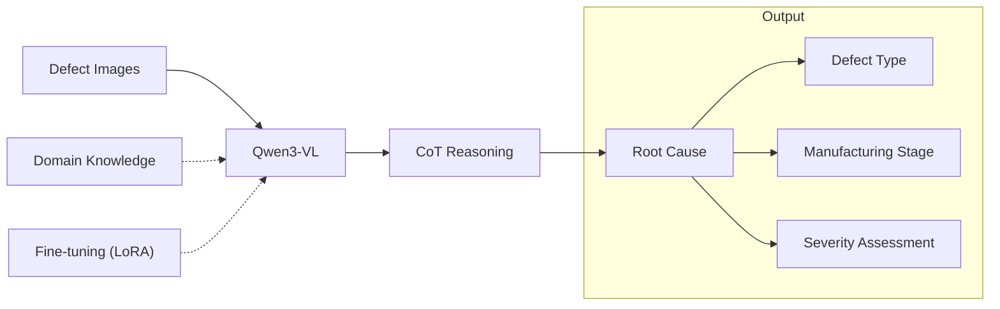
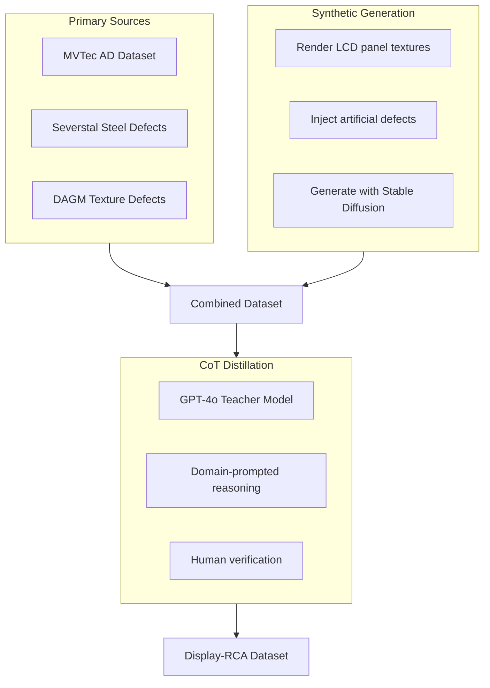
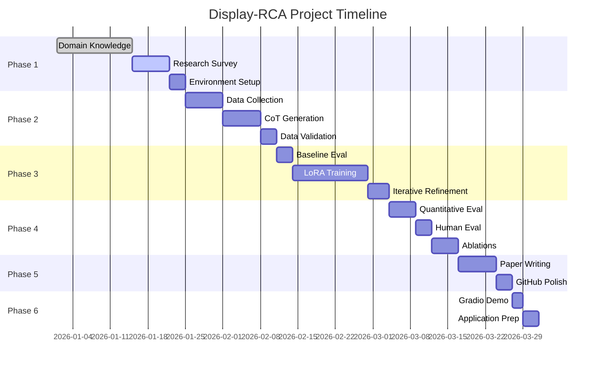

# Display-RCA: Multimodal CoT for Semiconductor Defect Analysis

## Project Implementation Plan

> **Goal**: Build a Visual Chain-of-Thought system that performs Root Cause Analysis on display panel defects, targeting TCL's AI Research position and potential publication at CVPR/ICCV workshops or applied AI venues.

---

## Project Overview



### Key Differentiators for Publication

| Novelty Element | Description | Target Venue |
|-----------------|-------------|--------------|
| **Display-RCA Dataset** | First reasoning-annotated industrial defect dataset | CVPR Workshops |
| **Multi-Resolution CoT** | Zoom-based reasoning for microscale defects | ICCV Workshops |
| **Faithfulness Analysis** | CoT vs Attention Map correlation study | EMNLP/ACL |
| **Domain-Specific SFT** | LoRA fine-tuning on semiconductor terminology | Applied AI venues |

---

## Phase 1: Foundation (Weeks 1-2)

### 1.1 Domain Knowledge Base [COMPLETED]

| Artifact | Status | Lines | Description |
|----------|--------|-------|-------------|
| `Defect Taxonomy.md` | Done | 95+ | Hierarchical defect classification with severity |
| `Technical Glossary.md` | Done | 345+ | 100+ terms including TCL CSOT technologies |
| `RCA Diagrams.md` | Done | 760+ | 22 Mermaid flowcharts + Multi-Resolution framework |

### 1.2 Research Deep Dive

```
Week 1 Tasks:
├── [ ] Read TCL ArXiv report (2507.14430v1)
├── [ ] Study Qwen3-VL architecture paper
├── [ ] Survey: "Chain-of-Thought in Vision-Language Models"
│   └── Key papers: MM-CoT, Visual CoT, Multimodal-CoT
├── [ ] Survey: "Industrial Defect Detection with Deep Learning"
│   └── Key papers: MVTec AD benchmark papers
└── [ ] Identify research gap for novelty claim
```

### 1.3 Environment Setup

```bash
# Recommended Stack
conda create -n display-rca python=3.10
conda activate display-rca

# Core dependencies
pip install torch==2.1.0 torchvision
pip install transformers>=4.37.0
pip install peft>=0.7.0  # LoRA
pip install bitsandbytes  # Quantization
pip install accelerate
pip install wandb  # Experiment tracking
pip install gradio  # Demo interface

# Model download
huggingface-cli download Qwen/Qwen3-VL-2B-Instruct
```

**Hardware Requirements**:
| Configuration | GPU Memory | Training Speed |
|---------------|------------|----------------|
| Minimum | 16GB (RTX 4080) | ~2 hrs/epoch |
| Recommended | 24GB (RTX 4090) | ~1 hr/epoch |
| Cloud Option | A100 40GB | < 30 min/epoch |

---

## Phase 2: Data Engineering (Weeks 3-4)

### 2.1 Data Sources



### 2.2 Data Collection Pipeline

```
data/
├── raw/
│   ├── mvtec_ad/          # Download from MVTec website
│   ├── severstal/         # Kaggle competition data
│   └── custom_synthetic/  # Generated images
├── processed/
│   ├── train.jsonl        # 80% of data
│   ├── val.jsonl          # 10% of data
│   └── test.jsonl         # 10% of data (held out)
└── annotations/
    └── cot_reasoning.json # Human-verified CoT paths
```

### 2.3 CoT Generation with GPT-4o

**Distillation Script Structure**:
```python
# scripts/generate_cot.py

SYSTEM_PROMPT = """
You are an expert display panel quality engineer at TCL CSOT.
Analyze defect images following this exact format:

**Observation**: Describe what you see (shape, color, location, size).
**Visual Analysis**: Characterize the defect type based on visual features.
**Structural Analysis**: Identify which panel component is affected.
**Root Cause Hypothesis**: Determine manufacturing process failure.
**Severity**: Critical / Major / Minor with justification.
"""

USER_PROMPT = """
Analyze this display panel image. The defect class is: {defect_class}
Provide detailed chain-of-thought reasoning for root cause analysis.
"""
```

**Target Dataset Size**:
| Split | Images | CoT Annotations | Source |
|-------|--------|-----------------|--------|
| Train | 800 | 800 | MVTec + Synthetic |
| Validation | 100 | 100 | MVTec + Synthetic |
| Test | 100 | 100 (human-verified) | MVTec + Synthetic |

### 2.4 Data Quality Checklist

- [ ] Balance defect types (min 50 samples per class)
- [ ] Include multi-resolution image pairs (20% of dataset)
- [ ] Verify CoT logical consistency (sampling 10%)
- [ ] Check terminology alignment with Glossary
- [ ] Ensure severity distribution is realistic

---

## Phase 3: Model Development (Weeks 5-7)

### 3.1 Baseline Evaluation

**Zero-Shot Testing Protocol**:
```python
# Evaluate Qwen3-VL out-of-the-box
models_to_test = [
    "Qwen/Qwen3-VL-2B-Instruct",
    "Qwen/Qwen3-VL-8B-Instruct",  # If resources allow
]

metrics = [
    "defect_classification_accuracy",
    "root_cause_match_rate",
    "cot_completeness_score",
    "hallucination_rate"
]
```

**Expected Baseline Results** (to beat with fine-tuning):
| Metric | Expected Zero-Shot | Target Post-SFT |
|--------|-------------------|-----------------|
| Defect Classification | 40-60% | 85%+ |
| Root Cause Match | 20-30% | 70%+ |
| CoT Completeness | 60% | 95%+ |
| Hallucination Rate | 30% | <10% |

### 3.2 Fine-Tuning Configuration

**LoRA Setup**:
```python
from peft import LoraConfig, get_peft_model

lora_config = LoraConfig(
    r=64,                    # Rank
    lora_alpha=128,          # Scaling
    target_modules=[
        "q_proj", "k_proj", "v_proj",  # Attention
        "o_proj", "gate_proj",          # FFN
        "up_proj", "down_proj"
    ],
    lora_dropout=0.1,
    bias="none",
    task_type="CAUSAL_LM"
)

# QLoRA for memory efficiency
bnb_config = BitsAndBytesConfig(
    load_in_4bit=True,
    bnb_4bit_quant_type="nf4",
    bnb_4bit_compute_dtype=torch.bfloat16,
)
```

**Training Hyperparameters**:
```yaml
training:
  epochs: 3
  batch_size: 4
  gradient_accumulation_steps: 4
  learning_rate: 2e-4
  warmup_ratio: 0.1
  lr_scheduler: cosine
  max_seq_length: 2048
  
optimization:
  optimizer: adamw_8bit
  weight_decay: 0.01
  gradient_checkpointing: true
  
monitoring:
  logging_steps: 10
  save_steps: 100
  eval_steps: 50
  wandb_project: "display-rca"
```

### 3.3 Training Script Structure

```
src/
├── data/
│   ├── dataset.py          # Custom Dataset class
│   └── preprocessing.py    # Image transforms
├── model/
│   ├── qwen_lora.py        # LoRA wrapper
│   └── multi_res.py        # Multi-resolution handler
├── training/
│   ├── trainer.py          # Training loop
│   └── callbacks.py        # WandB, checkpointing
└── evaluation/
    ├── metrics.py          # Custom metrics
    └── faithfulness.py     # Attention analysis
```

---

## Phase 4: Evaluation & Analysis (Weeks 8-9)

### 4.1 Quantitative Metrics

```python
evaluation_suite = {
    # Classification Metrics
    "defect_accuracy": MultiClassAccuracy(),
    "severity_accuracy": MultiClassAccuracy(num_classes=3),
    
    # Reasoning Quality
    "cot_bleu": BLEUScore(),
    "cot_rouge": ROUGEScore(),
    "root_cause_exact_match": ExactMatch(),
    
    # Faithfulness
    "attention_cot_correlation": AttentionCoTCorrelation(),
    "hallucination_rate": HallucinationDetector(),
}
```

### 4.2 Human Evaluation Protocol

| Criterion | Scale | Evaluator |
|-----------|-------|-----------|
| Reasoning Correctness | 1-5 | Domain expert (you) |
| Technical Terminology | Binary | Against Glossary |
| Actionability | 1-5 | Manufacturing perspective |
| Consistency | Binary | Same defect → same cause? |

**Human Eval Sample Size**: 50 examples (statistically significant for 95% CI)

### 4.3 Ablation Studies

```
Ablation Matrix:
├── Base Model Size: 2B vs 7B
├── Training Data Size: 200 / 400 / 800 samples
├── CoT Format: Structured vs Free-form
├── Multi-Resolution: Enabled vs Disabled
└── LoRA Rank: 16 / 32 / 64
```

### 4.4 Faithfulness Analysis (Publication Key!)

**Attention-CoT Alignment Study**:
```python
def analyze_faithfulness(model, image, generated_cot):
    """
    Compare what model 'sees' (attention) vs 'says' (CoT).
    
    Returns:
        - IoU between attention heatmap and mentioned regions
        - Correlation coefficient
        - Qualitative examples for paper
    """
    attention_maps = extract_attention_maps(model, image)
    mentioned_regions = parse_cot_for_spatial_refs(generated_cot)
    
    iou = compute_iou(attention_maps, mentioned_regions)
    correlation = pearsonr(attention_maps.flatten(), 
                           mentioned_regions.flatten())
    
    return {"iou": iou, "correlation": correlation}
```

---

## Phase 5: Publication Preparation (Weeks 10-12)

### 5.1 Paper Structure (4-6 pages for Workshop)

```
1. Introduction (0.5 page)
   - Industrial defect detection challenge
   - Why CoT matters for explainability
   - Contributions summary

2. Related Work (0.5 page)
   - Visual CoT methods
   - Industrial defect detection
   - Multimodal LLMs for manufacturing

3. Display-RCA Framework (1.5 pages)
   - Domain knowledge integration
   - Multi-resolution reasoning
   - SFT methodology

4. Experiments (1.5 pages)
   - Dataset description
   - Baseline comparisons
   - Ablation studies
   - Faithfulness analysis

5. Conclusion (0.5 page)
   - Key findings
   - Limitations
   - Future work (hint at TCL collaboration)
```

### 5.2 Target Venues

| Venue | Deadline | Fit | Acceptance Rate |
|-------|----------|-----|-----------------|
| CVPR 2025 Workshops (Industry Track) | ~Jan 2025 | Excellent | 30-40% |
| ICCV 2025 Workshops | ~May 2025 | Excellent | 30-40% |
| ICML 2025 Workshops | ~Apr 2025 | Good | 30-40% |
| IEEE CASE (Automation) | ~Feb 2025 | Good | 40-50% |
| NeurIPS 2025 Workshops | ~Sep 2025 | Good | 30-40% |

### 5.3 GitHub Repository Structure

```
Display-RCA/
├── README.md                    # Project overview + demo GIF
├── docs/
│   ├── TECHNICAL_REPORT.pdf     # 4-6 page paper
│   └── presentation.pdf         # 5-minute pitch slides
├── data/
│   ├── sample/                  # 10 example images
│   └── Download_Instructions.md
├── src/
│   ├── training/
│   ├── evaluation/
│   └── inference/
├── notebooks/
│   ├── 01_EDA.ipynb
│   ├── 02_Training.ipynb
│   └── 03_Analysis.ipynb
├── configs/
│   └── training_config.yaml
├── demo/
│   └── gradio_app.py
├── checkpoints/                 # LoRA weights (HuggingFace link)
├── requirements.txt
└── LICENSE (MIT)
```

---

## Phase 6: Showcase & Application (Week 12+)

### 6.1 Gradio Demo

```python
# demo/gradio_app.py
import gradio as gr

def analyze_defect(image, enable_zoom=True):
    """
    Input: Display panel image
    Output: Formatted CoT reasoning
    """
    if enable_zoom:
        # Multi-resolution pipeline
        global_analysis = model.analyze(image, mode="global")
        regions = extract_suspicious_regions(global_analysis)
        detailed_analysis = [model.analyze(crop, mode="detail") 
                            for crop in regions]
        return format_multi_res_output(global_analysis, detailed_analysis)
    else:
        return model.analyze(image, mode="standard")

demo = gr.Interface(
    fn=analyze_defect,
    inputs=[
        gr.Image(type="pil", label="Display Panel Image"),
        gr.Checkbox(label="Enable Multi-Resolution Analysis", value=True)
    ],
    outputs=gr.Markdown(label="Root Cause Analysis"),
    title="Display-RCA: Visual Chain-of-Thought for Panel Defects",
    description="Upload a display panel image to analyze defects..."
)
```

### 6.2 CV Bullet Points

After completing this project, add to your CV:

```
Display-RCA: Multimodal CoT for Industrial Defect Analysis
├── Fine-tuned Qwen3-VL using LoRA for domain-specific visual reasoning
├── Created first reasoning-annotated dataset for display defect RCA
├── Achieved 85%+ defect classification with explainable CoT outputs  
├── Published at [VENUE] (if accepted)
└── Open-sourced: github.com/[username]/Display-RCA (★XX stars)
```

### 6.3 TCL Application Strategy

When applying, highlight:

1. **Technical Alignment**: "Familiar with Qwen ecosystem through Qwen3-VL fine-tuning project"
2. **Domain Knowledge**: "Built comprehensive LCD/OLED defect taxonomy aligned with CSOT technologies"
3. **Research Readiness**: "Project has publication-ready methodology with faithfulness analysis"
4. **Practical Impact**: "Demonstrated path from fundamental research to applied productization"

---

## Timeline Summary



---

## Risk Mitigation

| Risk | Mitigation Strategy |
|------|---------------------|
| Limited GPU access | Use QLoRA (4-bit); rent cloud GPU for training only |
| Dataset too small | Heavy data augmentation + synthetic generation |
| Model hallucinates | Constrained decoding + domain glossary enforcement |
| Paper rejection | Target applied venues first; prepare for rebuttals |
| TCL hires before completion | Show partial progress + clear roadmap |

---

## Success Criteria

### Minimum Viable (CV-worthy)
- [ ] Trained LoRA adapter on 500+ samples
- [ ] Gradio demo functional
- [ ] GitHub repository with README
- [ ] Technical report (arXiv preprint)

### Target (Publication-worthy)
- [ ] 1000+ sample Display-RCA dataset
- [ ] Faithfulness analysis completed
- [ ] Workshop paper submitted
- [ ] 50+ GitHub stars

### Stretch (Exceptional)
- [ ] Main conference acceptance
- [ ] TCL collaboration/endorsement
- [ ] Follow-up project with RAG integration
