# Root Cause Analysis (RCA) Diagrams for Display Defects

This document contains diagnostic flowcharts following the Chain-of-Thought pattern:
**Visual Observation → Structural Analysis → Root Cause Hypothesis (Manufacturing Process)**

Each diagram shows how a single symptom can branch into multiple possible causes, reflecting real-world diagnostic complexity.

---

## 1. Vertical Line on Panel

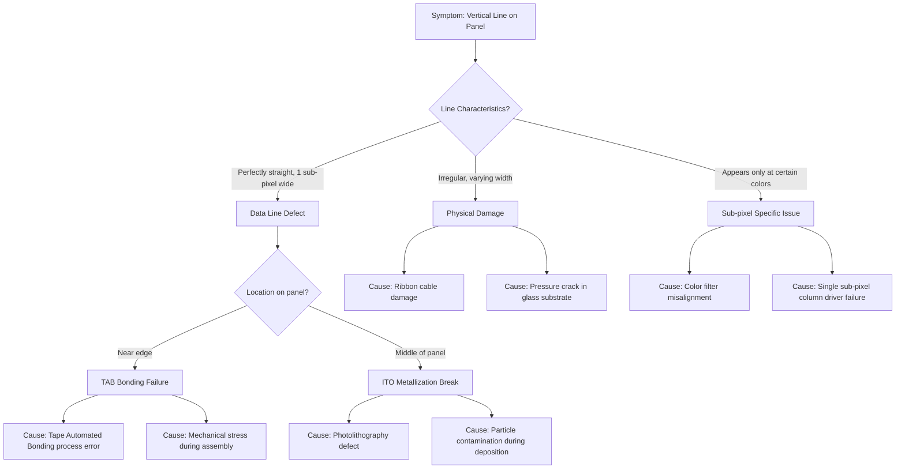

---

## 2. Horizontal Line on Panel

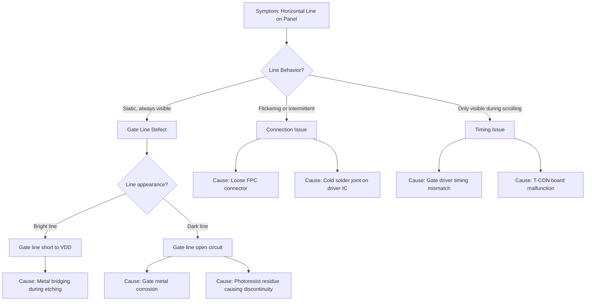

---

## 3. Dead/Dark Spots on Display

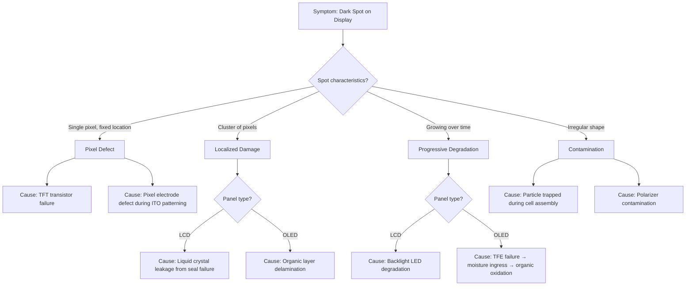

---

## 4. Mura (Uniformity Error)

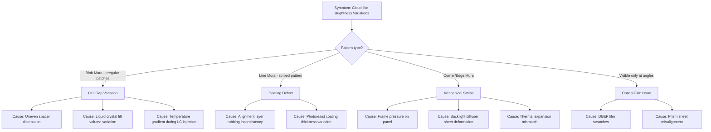

---

## 5. Color Abnormalities

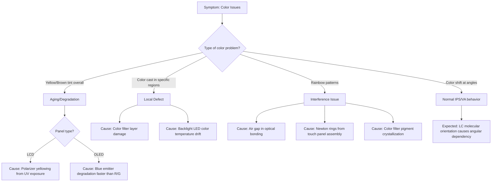

---

## 6. Flickering Display

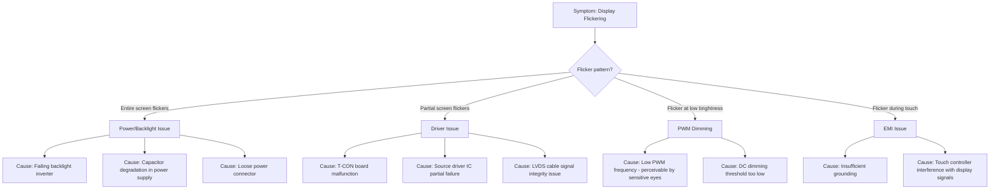

---

## 7. Image Retention / Burn-in

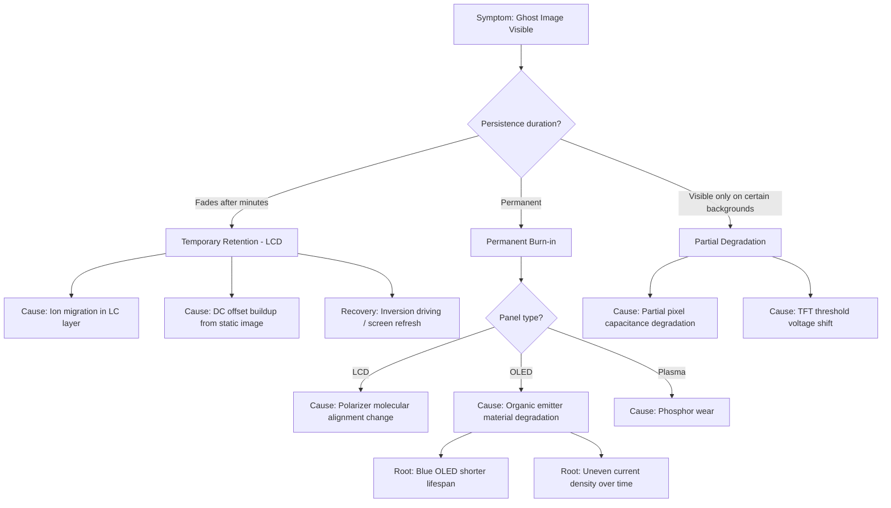

---

## 8. Touch Responsiveness Issues

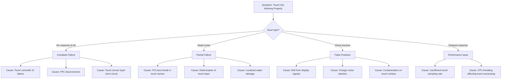

---

## 9. Backlight Issues

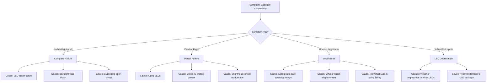

---

## 10. Cross-talk / Ghosting

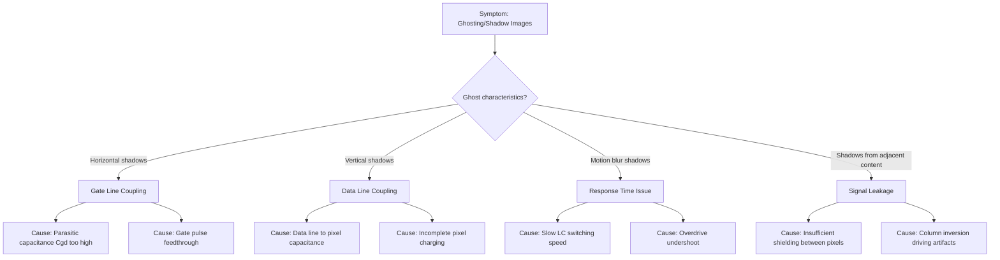

---

## 11. No Display / Black Screen

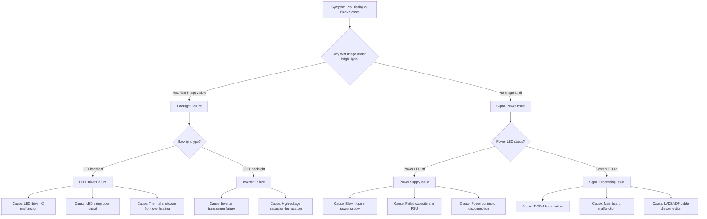

---

## 12. Polarizer Defects

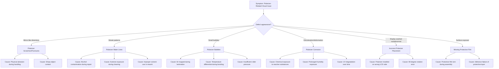

---

## 13. Physical Damage Assessment

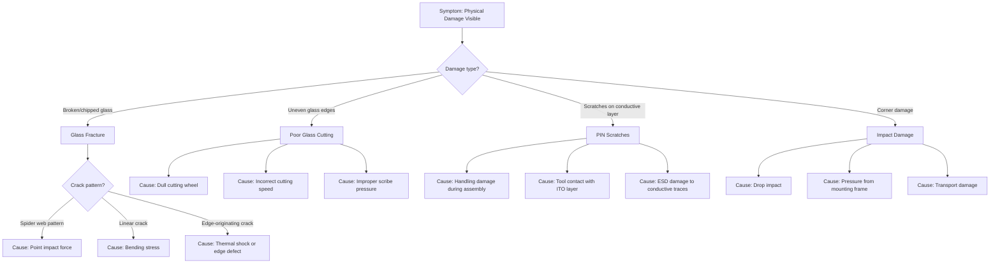

---

## 14. Light Leakage / Backlight Bleeding

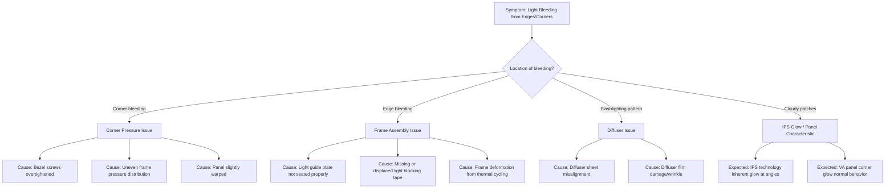

---

## 15. Color Banding

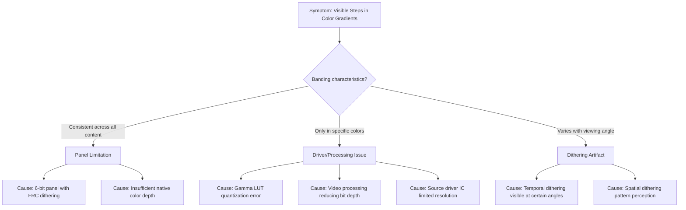

---

## 16. Inverse Ghosting (Coronas)

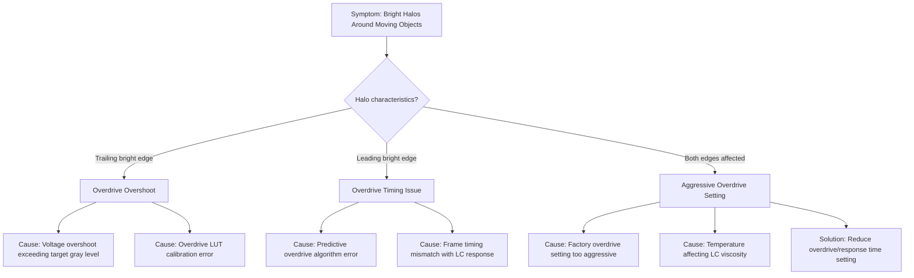

---

## 17. Newton Rings

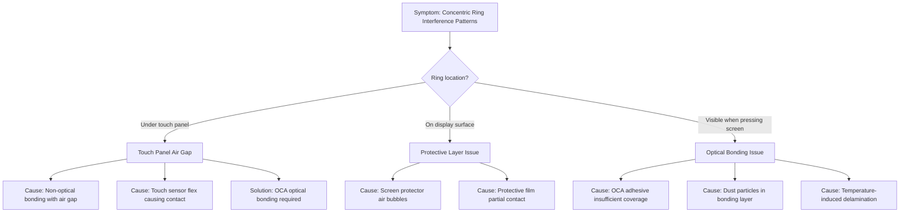

---

## 18. OLED-Specific Degradation

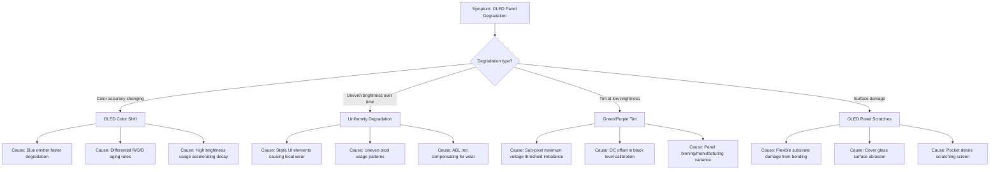

---

## 19. TFT Backplane Issues

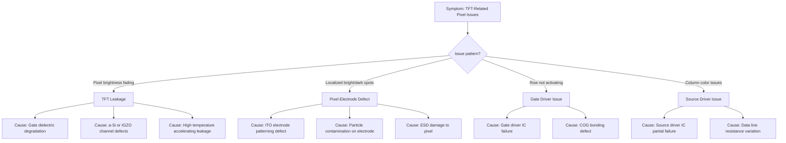

---

## 20. Internal Contamination & Scratches

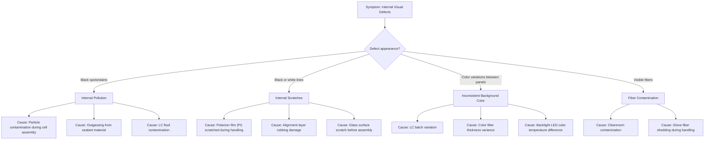

---

## 21. Surface & Assembly Defects

```mermaid
flowchart TD
    A["Symptom: Surface/Assembly Related Issues"] --> B{"Defect type?"}
    
    B -->|"Visible bumps on display"| C["Convex Spots"]
    B -->|"Visible fibers on surface"| D["Surface Fiber Contamination"]
    B -->|"Inconsistent performance"| E["Mixed LCD Panels"]
    
    C --> C1["Cause: Dust trapped on LCD surface"]
    C --> C2["Cause: Foreign particle under optical films"]
    C --> C3["Cause: Adhesive residue bump"]
    
    D --> D1["Cause: Contamination during final assembly"]
    D --> D2["Cause: Fiber from packaging material"]
    
    E --> E1["Cause: Different manufacturers mixed"]
    E --> E2["Cause: Different production batches combined"]
    E --> E3["Cause: Panel grade mixing in production"]
```

---

## 22. Distorted Colors / Contrast Issues

```mermaid
flowchart TD
    A["Symptom: Washed-out or Poor Contrast"] --> B{"Issue scope?"}
    
    B -->|"Entire display affected"| C["System-wide Issue"]
    B -->|"Gradual deterioration"| D["Component Aging"]
    B -->|"Sudden change"| E["Component Failure"]
    
    C --> C1{"Check T-CON board"}
    C1 -->|"Burnt components visible"| C2["Cause: T-CON component failure"]
    C1 -->|"Bulging capacitors"| C3["Cause: Capacitor degradation"]
    C1 -->|"No visible damage"| C4["Cause: Incorrect voltage settings"]
    
    D --> D1["Cause: Polarizer degradation from UV"]
    D --> D2["Cause: LC fluid property change over time"]
    D --> D3["Cause: Backlight color temperature drift"]
    
    E --> E1["Cause: LVDS cable partial failure"]
    E --> E2["Cause: Gamma IC malfunction"]
    E --> E3["Cause: Power rail voltage deviation"]
```

---

## RCA Pattern Summary

The diagnostic process follows this general pattern:

```mermaid
flowchart LR
    A["Visual Symptom"] --> B["Characterize Defect"]
    B --> C["Narrow Down Category"]
    C --> D["Identify Specific Failure Mode"]
    D --> E["Trace to Manufacturing Process"]
    E --> F["Root Cause Hypothesis"]
    
    style A fill:#ffcccc
    style F fill:#ccffcc
```

### Key Manufacturing Processes Referenced:
| Process | Related Defects |
|---------|-----------------|
| Photolithography | ITO patterning defects, line breaks, shorts |
| Thin Film Deposition | TFT failures, electrode defects, TFT leakage |
| TAB/COF Bonding | Edge connection failures, driver IC issues |
| Cell Assembly | Contamination, LC fill issues, gap variation, internal scratches |
| Optical Film Lamination | Mura, bubbles, Newton rings, polarizer defects |
| Glass Cutting | Edge defects, panel cracks |
| Polarizer Application | Water lines, bubbles, corrosion, placement errors |
| TFE Encapsulation (OLED) | Moisture ingress, dark spot growth, color shift |
| Final Assembly | Surface contamination, light leakage, backlight bleeding |

---

## Multi-Resolution Reasoning Framework

> **Problem**: Standard MLLMs resize images (e.g., to 448×448), losing critical pixel-level defect information. This framework enables reasoning across multiple resolution scales.

### When to Apply Multi-Resolution Analysis

```mermaid
flowchart TD
    A["Input: Full Panel Image"] --> B{"Defect visible at global scale?"}
    
    B -->|"Yes, clearly visible"| C["Standard RCA Path"]
    B -->|"Partially visible"| D["Multi-Resolution Analysis"]
    B -->|"Suspected but unclear"| D
    
    D --> E["Step 1: Global Localization"]
    E --> F["Step 2: Region Cropping"]
    F --> G["Step 3: High-Res Analysis"]
    G --> H["Step 4: Context Integration"]
    H --> I["Final Root Cause Diagnosis"]
    
    C --> I
    
    style D fill:#ffffcc
    style E fill:#e6f3ff
    style F fill:#e6f3ff
    style G fill:#e6f3ff
    style H fill:#e6f3ff
```

### Multi-Resolution RCA Template

```mermaid
flowchart TD
    subgraph Global["🔍 Global View (Full Panel)"]
        G1["Identify suspicious regions"]
        G2["Assess defect distribution pattern"]
        G3["Note panel location context"]
    end
    
    subgraph Crop["Crop Decision"]
        C1{"Defect type requires\nmicroscopic analysis?"}
        C1 -->|"Pixel defects"| C2["Crop: 64×64 px region"]
        C1 -->|"Line defects"| C3["Crop: 256×64 or 64×256 strip"]
        C1 -->|"Area defects (Mura)"| C4["Crop: 256×256 region"]
    end
    
    subgraph HighRes["High-Resolution Analysis"]
        H1["Sub-pixel level inspection"]
        H2["Edge sharpness analysis"]
        H3["Pattern regularity check"]
    end
    
    subgraph Integration["Context Integration"]
        I1["Combine global position + local detail"]
        I2["Cross-reference with panel schematic"]
        I3["Manufacturing process correlation"]
    end
    
    Global --> Crop --> HighRes --> Integration
```

### Example: Pixel Defect with Multi-Resolution

```mermaid
flowchart TD
    A["Global View: 'Small dark spot detected in upper-left quadrant'"]
    
    A --> B["Crop Region: 64×64 pixels centered on anomaly"]
    
    B --> C{"High-Res Observation"}
    C -->|"Single sub-pixel dark"| D1["Dead Sub-pixel"]
    C -->|"3×3 pixel cluster dark"| D2["TFT Array Defect"]
    C -->|"Irregular dark shape"| D3["Particle Contamination"]
    
    D1 --> E1["Root Cause: Source driver voltage failure\nfor single column at this position"]
    D2 --> E2["Root Cause: Gate line partial short\ncausing localized row/column failure"]
    D3 --> E3["Root Cause: Cleanroom contamination\nduring cell assembly process"]
    
    E1 --> F["Context: Upper-left position suggests\ndriver IC near edge - check COF bonding"]
    E2 --> F
    E3 --> F
    
    style B fill:#ffffcc
    style C fill:#e6f3ff
```

### Resolution Strategy by Defect Type

| Defect Category | Global View Purpose | Crop Strategy | High-Res Focus |
|-----------------|---------------------|---------------|----------------|
| Dead/Stuck Pixels | Location, clustering pattern | 32-64px around defect | Sub-pixel RGB analysis |
| Line Defects | Full line trajectory | Narrow strip along line | Edge irregularity, width consistency |
| Mura | Overall distribution | Multiple 256×256 samples | Intensity gradient analysis |
| Contamination | Count, distribution | Individual particle crops | Shape, color, transparency |
| Burn-in | Pattern recognition | UI element region | Differential degradation |

### Confidence Adjustment Rules

| Scenario | Confidence Modifier |
|----------|---------------------|
| Global + High-Res findings align | ↑ +20% confidence |
| Findings contradict | ↓ -30% confidence, request additional crops |
| High-Res reveals new details | Revise initial hypothesis |
| Edge-of-crop artifacts visible | ↓ -10%, expand crop region |
